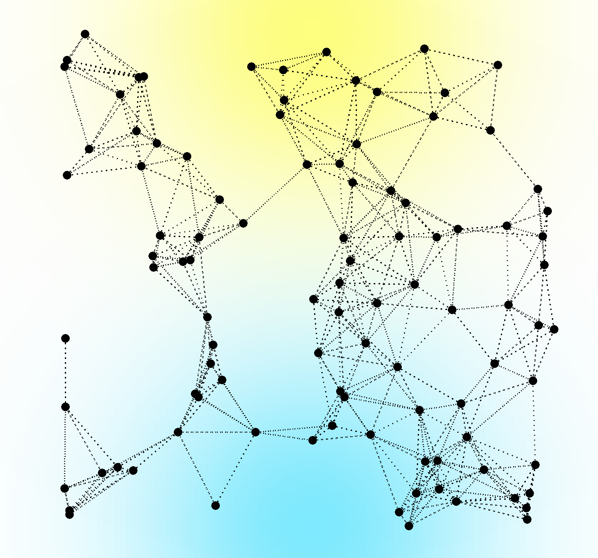
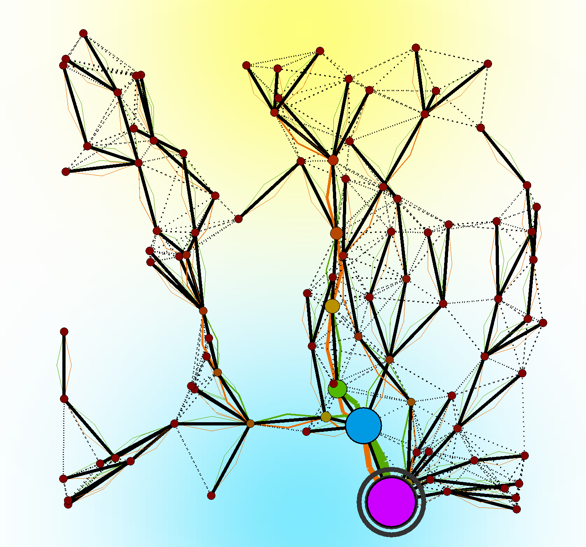
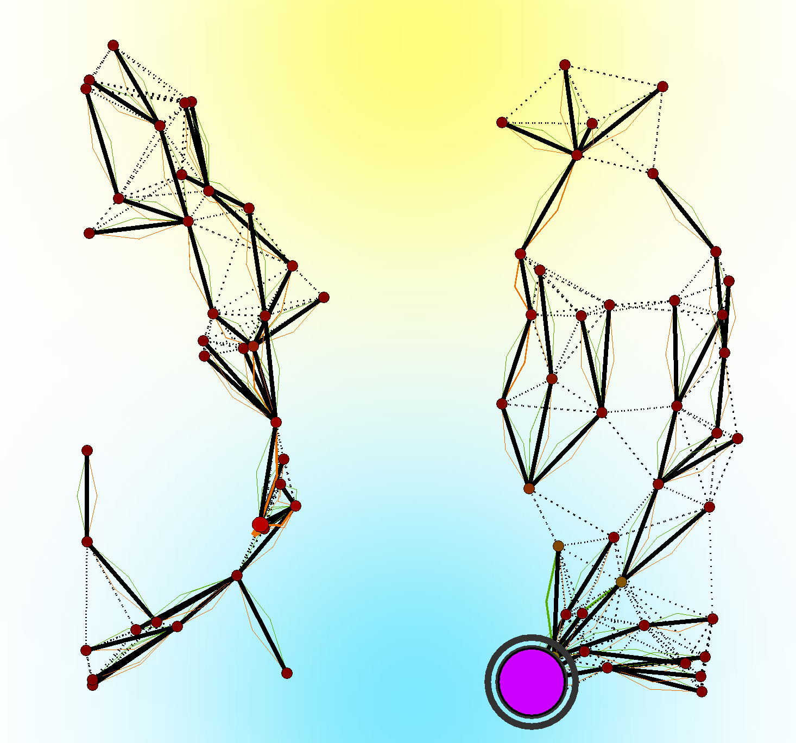
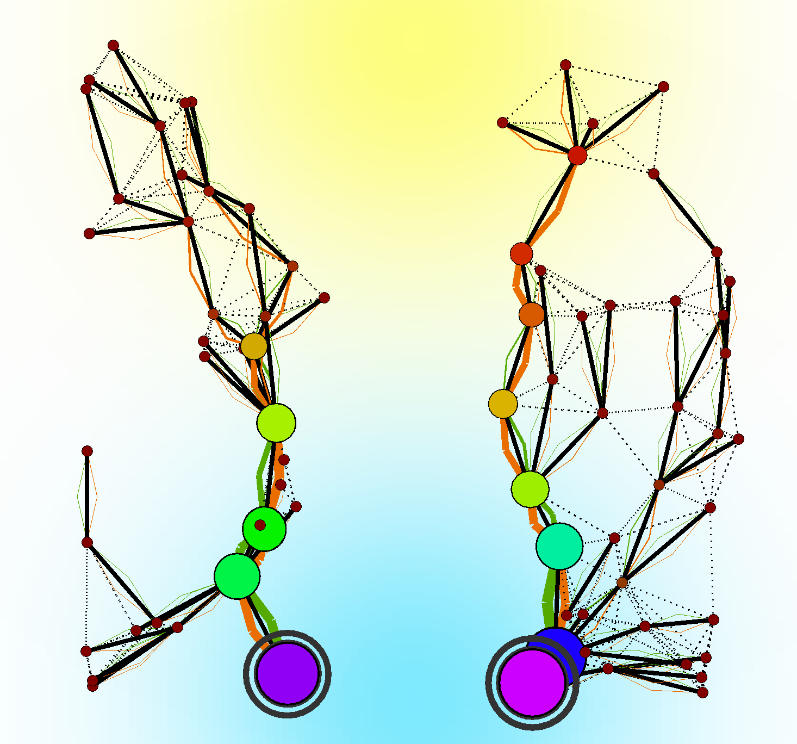

# _An Aggregate Vascular Morphogenesis Controller for Engineered Self-Organising Spatial Structures_

#### Authors temporarily anonymised for double-blind review

## About

In the field of evolutionary computing, the concept of Vascular Morphogenesis Controller (VMC) 
has been proposed in to model the growth of artificial structures over time.

A thorough analysis of the VMC model revealed some limitations:
- assumes the organisation structure is a tree, here intended as a directed acyclic graph with a single root and with a single path connecting the root with each leaf;
- the model is implicitly synchronous, as it assumes that (i) the evaluation of the nodes must proceed from the leaves to the root (and back), and (ii) the update of the whole tree occurs atomically.
  
Although, depending on the context, these assumptions may be acceptable, in general they may induce (possibly hidden) 
abstraction gaps when VMC is used to model real-world systems, and, at the same time, limit the applicability of the 
pattern to engineered morphogenetic systems.

To address these limitations, in this work, we propose FieldVMC: a generalisation of the VMC model as a field-based 
computation, in the spirit of the Aggregate Programming (AP) paradigm.

## Experiments

This repository contains the source code for the experiments presented in the paper
"_An Aggregate Vascular Morphogenesis Controller for Engineered Self-Organising Spatial Structures_".

The experiments want to show the capabilities of the proposed model in generating self-organising spatial structures.

Some examples of the generated structures are shown below:

|       |                |
|:--------------------------------------------------:|:-----------------------------------------------------------------:|
|                *Starting Structure*                |                    *Self-Organised Structure*                     |
|  |  |
|       *Structure after cutting a part of it*       |           *Self-Organised Structure after the cutting*            | 

The images show the evolution of a structure from a starting configuration to a self-organised structure.

The goal of this evaluation is to show that the proposed FieldVMC supports the construction of the same structures of its 
predecessor, and, in addition, that it can work in scenarios not previously investigated. 
To this end, we designed a set of five experiments:
- self-construction from a single node (growth from seed),
- self-repair after disruption (network segmentation) with no regeneration (cutting),
- self-integration of multiple FieldVMC systems (grafting)
- self-segmentation of a larger structure (budding), and
- self-optimisation of multiple large structures into a more efficient one (abscission and regrowth).

## Reproduce the entire experiment

**WARNING**: re-running the whole experiment may take a very long time on a normal computer.

### Reproduce the experiments through Gradle

To reproduce the experiments, 
    you need to clone this repository on your pc,
    moving into the root folder and running the following command:

```shell
./gradlew run<ExperimentName>Graphic
```
substituting <ExperimentName> with the name of the experiment (in PascalCase) specified in the YAML simulation file.

Or execute ```./gradlew tasks``` to view the list of available tasks.

The corresponding YAML simulation files to the experiments cited above are the following:
- _oneRoot_: self-construction from a single node (growth from seed),
- _cutting_: self-repair after disruption (network segmentation) with no regeneration (cutting),
- _graft_: self-integration of multiple FieldVMC systems (grafting)
- _graftWithMoreLeaders_: self-segmentation of a larger structure (budding), and
- _graftWithSpawning_: self-optimisation of multiple large structures into a more efficient one (abscission and regrowth).
